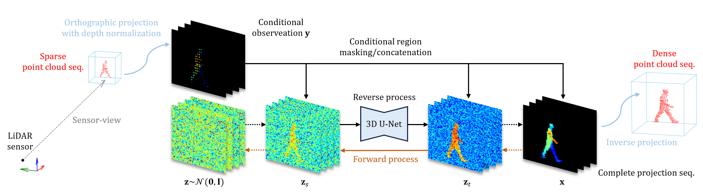

# LidarGSU

* This is the official implementation of our paper, [**Gait Sequence Upsampling using Diffusion Models for Single LiDAR Sensors**](https://arxiv.org/abs/2410.08680).
* LidarGSU is a sparse-to-dense upsampling model for 3D LiDAR pedestrian point clouds, designed to improve the generalization capability of existing person identification models.

## Overview

<p align="center">
  </br>
  <span align="center">Overview of our LidarGSU. The diffusion process operates in the orthographic projection domain with normalized depth values.</span> 
</p>


## Results

<p align="center">
  </br>
  <span align="center">Upsampled results using LidarGSU on the SUSTeck1K dataset for the Normal attribute.</span> 
</p>


<p align="center">
  </br>
  <span align="center">The 3D point cloud sequence upsampled by LidarGSU from sparse LiDAR input (VLP-32C).</span> 
</p>


## Setup

### Dataset (Optional)

For training and evaluation, download the [**SUSTeck1K**](https://github.com/ShiqiYu/OpenGait/blob/master/datasets/SUSTech1K/README.md).
**KUGait30**, which was used in our experiments for real-world senarios, is not publicly available at the moment.
However, you may adapt our pipeline to train and evaluate with your own data.


### Dependencies

Clone this repository:

```bash
git clone https://github.com/jeongho9413/lidargsu.git
cd lidagsu
```

Install dependencies:
```bash
pip install -r requirements.txt
```


## Getting started

### Training

Convert the 3D pedestrian point clouds into depth-based representations and build the training set on **SUSTeck1K**:

````bash
python lidar2deppos.py --implementation_mode preprocessing \
  --sensor_name vls-128 \
  --projection_mode ortho \
  --set_name train \
  --res_const 0.04 \
  --frame_const all \
  --dataset_name susteck1k
````

Train the LidarGSU model:

````bash
python main.py --train_path ./datasets/susteck1k/projection/ortho_depth-pos_drop-point_pkl \
  --json_path configs/susteck1k/susteck1k.json \
  --dataset susteck1k \
  --mode train \
  --num_sample_steps 32
````

### Evaluation

Preprocess the test set:

````bash
python lidar2deppos.py --implementation_mode preprocessing \
  --sensor_name vls-128 \
  --projection_mode ortho \
  --set_name test \
  --res_const 0.04 \
  --frame_const all \
  --dataset_name susteck1k
````

Evaluate the trained model:

````bash
python main.py --train_path ./datasets/susteck1k/projection/ortho_depth-pos_drop-point_pkl \
  --pretrained_path ./model_iter200000.pt \
  --json_path configs/susteck1k/susteck1k.json \
  --dataset susteck1k \
  --mode test \
  --num_sample_steps 32
````


## Citation

If you find this repository useful for your work, please cite our paper:

```bibtex
@inproceedings{sii2025_ahn,
  title     = {Gait Sequence Upsampling using Diffusion Models for Single LiDAR Sensors},
  author    = {Ahn, Jeongho and Nakashima, Kazuto and Yoshino, Koki and Iwashita, Yumi and Kurazume, Ryo},
  booktitle = {Proceedings of the IEEE/SICE International Symposium on System Integration (SII)},
  year      = {2025},
  pages     = {658--664},
  paper     = {https://doi.org/10.1109/SII59315.2025.10870999},
}
```

## Acknowledgements
* LidarGait is based on [ShiqiYu/OpenGait](https://github.com/ShiqiYu/OpenGait/tree/master).


